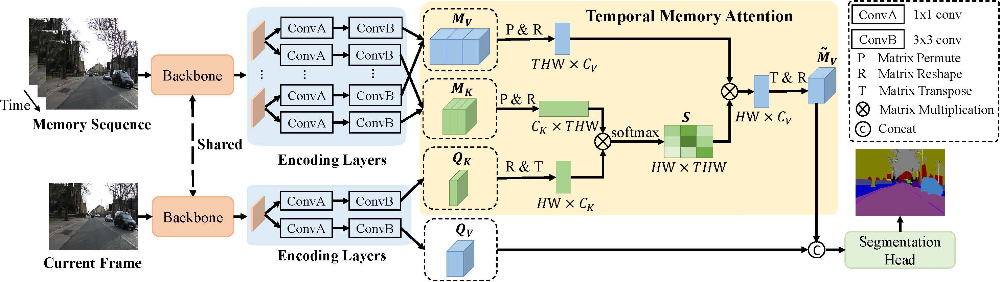

# Temporal Memory Attention for Video Semantic Segmentation, [arxiv](https://arxiv.org/abs/2102.08643)

## Introduction
We propose a Temporal Memory Attention Network (TMANet) to adaptively integrate the long-range temporal relations over 
the video sequence based on the self-attention mechanism without exhaustive optical flow prediction.
Our method achieves new state-of-the-art performances on two challenging video semantic segmentation datasets, 
particularly 80.3% mIoU on Cityscapes and 76.5% mIoU on CamVid with ResNet-50.



## Updates
2021/1: TMANet training and evaluation code released.
## Usage
* Install mmseg
  * Please refer to [mmsegmentation](https://github.com/open-mmlab/mmsegmentation) to get installation guide. 
  * This repository is based on mmseg-0.7.0 and pytorch 1.6.0.
* Clone the repository.
  ```shell
  git clone https://github.com/wanghao9610/TMANet.git
  cd TMANet
  pip install -e .
  ```
* Prepare the datasets
  * Download [Cityscapes](https://www.cityscapes-dataset.com/) dataset and [Camvid](http://mi.eng.cam.ac.uk/research/projects/VideoRec/CamVid/) dataset. 
  * For Camvid dataset, we need to extract frames from downloaded
    videos, please view the code on ./tools/convert_datasets/.
  * Put the converted datasets on ./data/camvid and ./data/cityscapes path.
    
    File structure of video semantic segmentation dataset is as followed.
    ```none
    ├── data                                              ├── data                  
    │   ├── cityscapes                                    │   ├── camvid
    │   │   ├── gtFine                                    │   │   ├── images
    │   │   │   ├── train                                 │   │   │   ├── train
    │   │   │   │   ├── xxx{img_suffix}                   │   │   │   │   ├── xxx{img_suffix}
    │   │   │   │   ├── yyy{img_suffix}                   │   │   │   │   ├── yyy{img_suffix}
    │   │   │   │   ├── zzz{img_suffix}                   │   │   │   │   ├── zzz{img_suffix}
    │   │   │   ├── val                                   │   │   │   ├── val
    │   │   ├── leftImg8bit                               │   │   ├── annotations
    │   │   │   ├── train                                 │   │   │   ├── train
    │   │   │   │   ├── xxx{seg_map_suffix}               │   │   │   │   ├── xxx{seg_map_suffix}
    │   │   │   │   ├── yyy{seg_map_suffix}               │   │   │   │   ├── yyy{seg_map_suffix}
    │   │   │   │   ├── zzz{seg_map_suffix}               │   │   │   │   ├── zzz{seg_map_suffix}
    │   │   │   ├── val                                   │   │   │   ├── val
    │   │   ├── leftImg8bit_sequence                      │   │   ├── image_sequence
    │   │   │   ├── train                                 │   │   │   ├── train
    │   │   │   │   ├── xxx{sequence_suffix}              │   │   │   │   ├── xxx{sequence_suffix}
    │   │   │   │   ├── yyy{sequence_suffix}              │   │   │   │   ├── yyy{sequence_suffix}
    │   │   │   │   ├── zzz{sequence_suffix}              │   │   │   │   ├── zzz{sequence_suffix}
    │   │   │   ├── val                                   │   │   │   ├── val
    ```

* Evaluation
  * Download the trained models for [Cityscapes](https://drive.google.com/drive/folders/16EMm46zRIKkGC-wIse4In5lV6zUZCIQB) and [Camvid](link2). And put them on ./work_dirs/{config_file}  
  * Run the following command(on Cityscapes):
  ```shell
  mkdir -p work_dirs/tmanet_r50-d8_769x769_80k_cityscapes_video
  sh eval.sh configs/video/cityscapes/tmanet_r50-d8_769x769_80k_cityscapes_video.py
  ```
* Training
  * Please download the pretrained [ResNet-50](https://drive.google.com/drive/folders/1IRkBsvJpZ1R1cS5La-7On03VoJErgvGX) model, and put it on ./init_models .
  * Run the following command(on Cityscapes):
  ```shell
  mkdir init_models
  sh train.sh configs/video/cityscapes/tmanet_r50-d8_769x769_80k_cityscapes_video.py
  ```
  Note: the above evaluation and training shell commands execute on Cityscapes, if you want to execute evaluation or 
  training on Camvid, please replace the config file on the shell command with the config file of Camvid.
## Citation
  If you find TMANet is useful in your research, please consider citing:
  ```shell
  @misc{wang2021temporal,
      title={Temporal Memory Attention for Video Semantic Segmentation}, 
      author={Hao Wang and Weining Wang and Jing Liu},
      year={2021},
      eprint={2102.08643},
      archivePrefix={arXiv},
      primaryClass={cs.CV}
  }
  ```
## Acknowledgement
Thanks [mmsegmentation](https://github.com/open-mmlab/mmsegmentation) contribution to the community!
